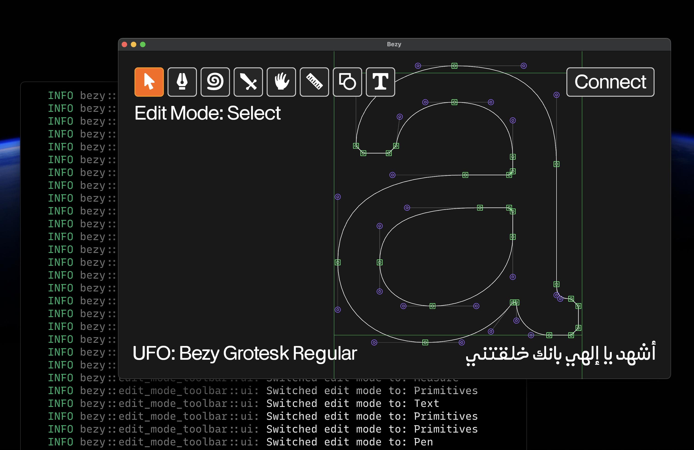
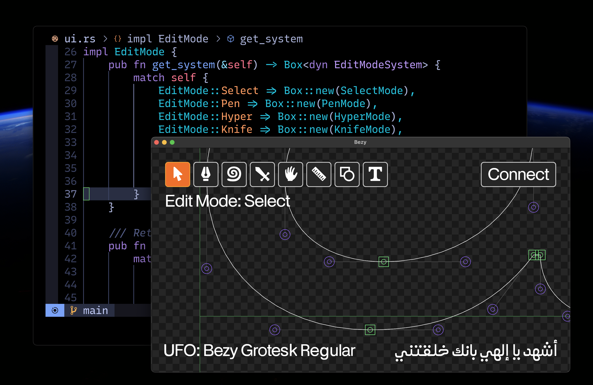

# Bezy Font Editor

⚠️ This software is very raw, and is not yet suitable for use unless you want to learn the codebase. But it is getting close and PRs are welcome!

Bezy is an open-source cross-platform font editor built with the [Bevy game engine](https://bevyengine.org/), the [Rust](https://www.rust-lang.org/) programming language, and various [Linebender Crates](https://linebender.org/) like [Norad](https://github.com/linebender/norad), and [Kurbo](https://github.com/linebender/kurbo). It is designed for simplicity, customization, user empowerment, education, and [AI-agent](.cursor/rules/bezy-app.mdc) assisted programming and type design.




A core design principle of this editor is user empowerment. Bezy aims to be the [Emacs](https://www.gnu.org/software/emacs/) of font editors. Users should be able to shape Bezy into a custom editor that perfectly fits their needs and aesthetics, like a calligrapher of the Arabic script making their own pens from simple reeds.

Post v1.0, Bezy will have built-in AI-agent functionality using Font Garden and other models allowing for highly automated AI-assisted workflows without giving up fine-grained control and attention to detail.

[UFO](https://unifiedfontobject.org/) is the current default source format.

## Table of Contents
- [About Bezy](#about-bezy)
- [Bezy Design Principles](#bezy-design-principles)
- [Installation](#installation)
- [Using Bezy](#using-bezy)
- [Developing with Bezy](#developing-with-bezy)
- [Documentation](#documentation)
- [Contributing](#contributing)
- [Community](#community)
- [License](#license)

## About Bezy

Bezy is loosely inspired by and ported from [Runebender](https://github.com/linebender/runebender), a previous font editor built with [Druid](https://github.com/linebender/druid), a data-first Rust-native UI design toolkit. It uses many of the same crates like [Norad](https://github.com/linebender/norad), and [Kurbo](https://github.com/linebender/kurbo). 

It is also a spiritual successor to the font editor [RoboFont](https://robofont.com/), specifically the RoboFont [design principles](https://robofont.com/documentation/topics/robofont-design-principles/).

## Bezy Design Principles

Bezy, like the Rust programming language, is fundamentally about empowerment. We believe typeface designers and editors should be encouraged to understand and modify their tools. The idea behind Bezy is to provide a sturdy framework where everyone can add their own functionalities.

## Installation

### Prerequisites:
- Rust (1.75.0 or later)
- Cargo (included with Rust)

### Steps:

1. **Install Rust** (if you haven't already):
   ```bash
   # For macOS, Linux, or WSL
   curl --proto '=https' --tlsv1.2 -sSf https://sh.rustup.rs | sh
   
   # Follow the on-screen instructions and restart your terminal
   ```
   Or visit https://www.rust-lang.org/tools/install for other platforms

2. **Clone the repository**:
   ```bash
   git clone https://github.com/eliheuer/bezy.git
   cd bezy
   ```

3. **Build and run**:
   ```bash
   cargo run -- --load-ufo assets/fonts/bezy-grotesk-regular.ufo --test-unicode 0061
   ```

## Using Bezy

### Basic Usage

Simply running `cargo run` will start Bezy with a default empty state.

### Command Line Arguments

Bezy supports several command line arguments to customize its behavior:

#### Loading a UFO Font File

```bash
cargo run -- --load-ufo <PATH_TO_UFO>
```

Example:
```bash
cargo run -- --load-ufo assets/fonts/bezy-grotesk-regular.ufo
```

#### Testing with Specific Unicode Characters

To test with a specific Unicode character:

```bash
cargo run -- --test-unicode <HEXADECIMAL_CODEPOINT>
```

Example (displays lowercase 'a'):
```bash
cargo run -- --test-unicode 0061
```

#### Combining Arguments

You can combine multiple arguments:

```bash
cargo run -- --load-ufo assets/fonts/bezy-grotesk-regular.ufo --test-unicode 0061
```

This loads the Bezy Grotesk font and displays the lowercase 'a' character.

#### Debug Mode

Enable additional debug information:

```bash
cargo run -- --debug
```

You can also control the logging verbosity using the `--log-level` option:

```bash
cargo run -- --log-level debug    # Show debug logs
cargo run -- --log-level info     # Show only info logs (default)
cargo run -- --log-level warn     # Show only warnings and errors
```
### The Bezy Grotesk Test Font

Bezy comes with a test font called "Bezy Grotesk" located in the `assets/fonts` directory. This is a UFO font format file that you can use to explore the editor's capabilities.

#### Key Features of Bezy Grotesk:
- Basic Latin characters
- Numbers and punctuation
- Special characters for the editor's UI
- Arabic script characters

To explore the font's structure, you can examine the UFO directory:
```
assets/fonts/bezy-grotesk-regular.ufo/
```

## Developing with Bezy

If you're new to Rust and want to contribute to Bezy:

1. Familiarize yourself with Bevy (the game engine): https://bevyengine.org/
2. Learn about the UFO font format: https://unifiedfontobject.org/
3. Read through the codebase, starting with `src/lib.rs` and `src/app.rs`
4. Try making small modifications to understand how things work
5. PRs are welcome!

## Documentation

Bezy has developer documentation available in the `docs/` directory:

- [Logger System](docs/logger.md) - Information about Bezy's custom logging system

## Contributing

Contributions to Bezy are welcome! Here's how you can help:

### Getting Started
1. Fork the repository
2. Create a feature branch (`git checkout -b feature/amazing-feature`)
3. Commit your changes (`git commit -m 'Add some amazing feature'`)
4. Push to the branch (`git push origin feature/amazing-feature`)
5. Open a Pull Request

### Contribution Guidelines
- Follow the existing code style (just run cargo fmt mostly)
- Write clear commit messages
- Add tests if needed
- Discuss major changes in an issue before implementation

## Community

Join the Bezy community:

- **GitHub Discussions**: For feature requests, questions, and general discussion
- **Issues Tracker**: For bugs and specific improvement suggestions

We're in the process of setting up additional community channels - check back soon!

## License

This project is licensed under the GPL.

The GNU General Public License is a free, [copyleft](https://en.wikipedia.org/wiki/Copyleft) license for software and other kinds of works.

The licenses for most software and other practical works are designed to take away your freedom to share and change the works. By contrast, the GNU General Public License is intended to guarantee your freedom to share and change all versions of a program--to make sure it remains free software for all its users. We, the Free Software Foundation, use the GNU General Public License for most of our software; it applies also to any other work released this way by its authors. You can apply it to your programs, too.

When we speak of free software, we are referring to freedom, not price. Our General Public Licenses are designed to make sure that you have the freedom to distribute copies of free software (and charge for them if you wish), that you receive source code or can get it if you want it, that you can change the software or use pieces of it in new free programs, and that you know you can do these things.

To protect your rights, we need to prevent others from denying you these rights or asking you to surrender the rights. Therefore, you have certain responsibilities if you distribute copies of the software, or if you modify it: responsibilities to respect the freedom of others.

For example, if you distribute copies of such a program, whether gratis or for a fee, you must pass on to the recipients the same freedoms that you received. You must make sure that they, too, receive or can get the source code. And you must show them these terms so they know their rights.
