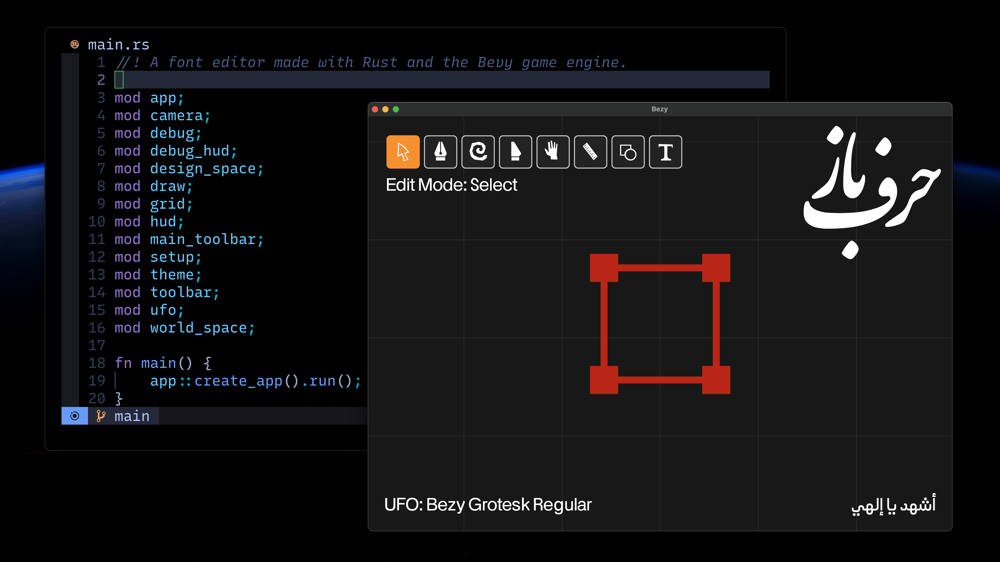

# Bezy Font Editor

Bezy is a font editor built with the Bevy game engine and Rust. It is designed for simplicity, customizability, and ease of use for LLM assisted vibes coding. 



## Installation


Prerequisites:
- Rust (1.75.0 or later)
- Cargo (included with Rust)

Install Rust if you haven't already: https://www.rust-lang.org/tools/install

Clone the repository:
```bash
git clone https://github.com/eliheuer/bezy.git
cd bezy
```

build and run:
```
cargo run
```

## License

This project is licenses under the GPL.

```
  The licenses for most software and other practical works are designed
to take away your freedom to share and change the works.  By contrast,
the GNU General Public License is intended to guarantee your freedom to
share and change all versions of a program--to make sure it remains free
software for all its users.  We, the Free Software Foundation, use the
GNU General Public License for most of our software; it applies also to
any other work released this way by its authors.  You can apply it to
your programs, too.

  When we speak of free software, we are referring to freedom, not
price.  Our General Public Licenses are designed to make sure that you
have the freedom to distribute copies of free software (and charge for
them if you wish), that you receive source code or can get it if you
want it, that you can change the software or use pieces of it in new
free programs, and that you know you can do these things.

  To protect your rights, we need to prevent others from denying you
these rights or asking you to surrender the rights.  Therefore, you have
certain responsibilities if you distribute copies of the software, or if
you modify it: responsibilities to respect the freedom of others.

  For example, if you distribute copies of such a program, whether
gratis or for a fee, you must pass on to the recipients the same
freedoms that you received.  You must make sure that they, too, receive
or can get the source code.  And you must show them these terms so they
know their rights.
```


